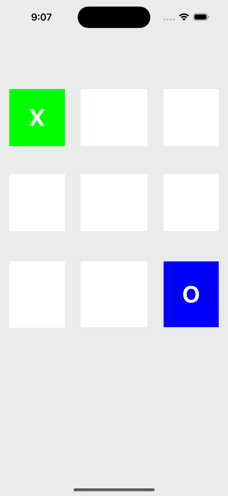
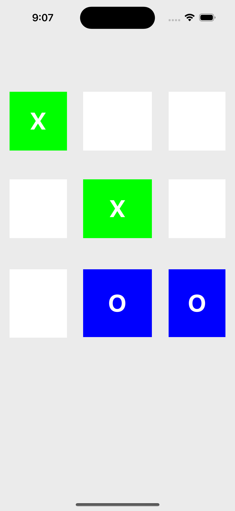
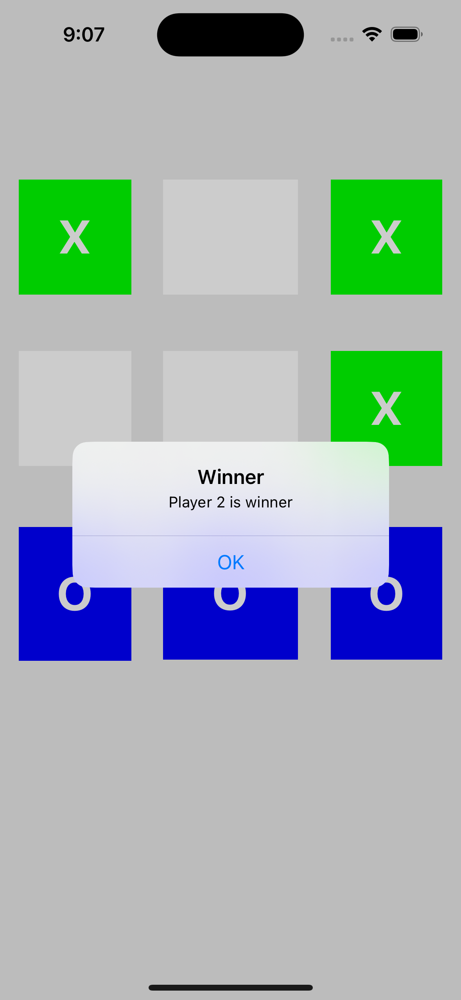

# Tic Tac Toe

<p align="center">
  
</p>

<p align="center">
  
  
  
  
  
</p>

iOS UIKit tic-tac-toe match: you play X against a blocking computer opponent on a 3×3 board.

**About:** `iOS Tic Tac Toe in Swift and UIKit. Play X against a blocking CPU with draws, a scoreboard, and restart.`

## Topics

15 GitHub topics (same count as the current sidebar), mixing high-traffic tags with game-specific ones. Drops the weak `game-develop` tag and `tic-tac-toe-multiplayer` (this build is player vs computer).

<p align="center">
  <a href="https://github.com/topics/ios"></a>
  <a href="https://github.com/topics/swift"></a>
  <a href="https://github.com/topics/uikit"></a>
  <a href="https://github.com/topics/xcode"></a>
  <a href="https://github.com/topics/ios-app"></a>
  <a href="https://github.com/topics/ios-game"></a>
  <a href="https://github.com/topics/ios-development"></a>
  <a href="https://github.com/topics/swift-game"></a>
  <a href="https://github.com/topics/game"></a>
  <a href="https://github.com/topics/game-development"></a>
  <a href="https://github.com/topics/mobile-app"></a>
  <a href="https://github.com/topics/mobile-game"></a>
  <a href="https://github.com/topics/tic-tac-toe"></a>
  <a href="https://github.com/topics/tictactoe"></a>
  <a href="https://github.com/topics/tic-tac-toe-game"></a>
</p>

`ios` · `swift` · `uikit` · `xcode` · `ios-app` · `ios-game` · `ios-development` · `swift-game` · `game` · `game-development` · `mobile-app` · `mobile-game` · `tic-tac-toe` · `tictactoe` · `tic-tac-toe-game`

## Highlights

- Player is X, computer is O
- Wins on rows, columns, and both diagonals
- Draw when the board is full
- Computer finishes its own line, then blocks, then prefers center and corners
- Scoreboard for wins, draws, and losses
- **Restart** / **Play again** clears the board and keeps the score

## How to play

Tap an empty cell to place X. The computer answers immediately. Three marks in a line wins. A full board with no line is a draw. After the alert, start a new round without wiping the match score.

## Architecture

```text
ViewController  →  TicTacToeEngine
     board UI         outcomes + computer move
```

| File | Role |
| --- | --- |
| `ViewController.swift` | Board buttons, alerts, scoreboard, restart |
| `TicTacToeEngine.swift` | Winning lines, draws, empty cells, blocking AI |

Open `TicTacToe.xcodeproj` in Xcode and run the **TicTacToe** scheme.

## Screenshots

<p>
  
  
  
</p>

## License

MIT © Halil OZEL. See the license text below.

<details>
<summary>MIT License</summary>

```
MIT License

Copyright (c) 2022 Halil OZEL

Permission is hereby granted, free of charge, to any person obtaining a copy
of this software and associated documentation files (the "Software"), to deal
in the Software without restriction, including without limitation the rights
to use, copy, modify, merge, publish, distribute, sublicense, and/or sell
copies of the Software, and to permit persons to whom the Software is
furnished to do so, subject to the following conditions:

The above copyright notice and this permission notice shall be included in all
copies or substantial portions of the Software.

THE SOFTWARE IS PROVIDED "AS IS", WITHOUT WARRANTY OF ANY KIND, EXPRESS OR
IMPLIED, INCLUDING BUT NOT LIMITED TO THE WARRANTIES OF MERCHANTABILITY,
FITNESS FOR A PARTICULAR PURPOSE AND NONINFRINGEMENT. IN NO EVENT SHALL THE
AUTHORS OR COPYRIGHT HOLDERS BE LIABLE FOR ANY CLAIM, DAMAGES OR OTHER
LIABILITY, WHETHER IN AN ACTION OF CONTRACT, TORT OR OTHERWISE, ARISING FROM,
OUT OF OR IN CONNECTION WITH THE SOFTWARE OR THE USE OR OTHER DEALINGS IN THE
SOFTWARE.
```

</details>
